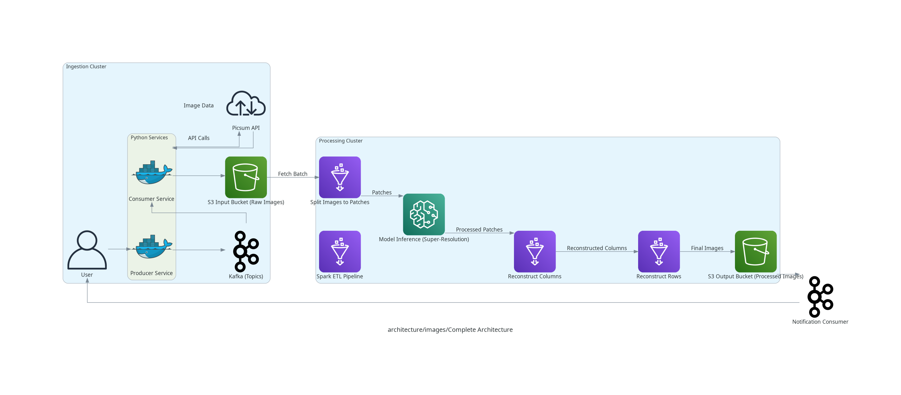
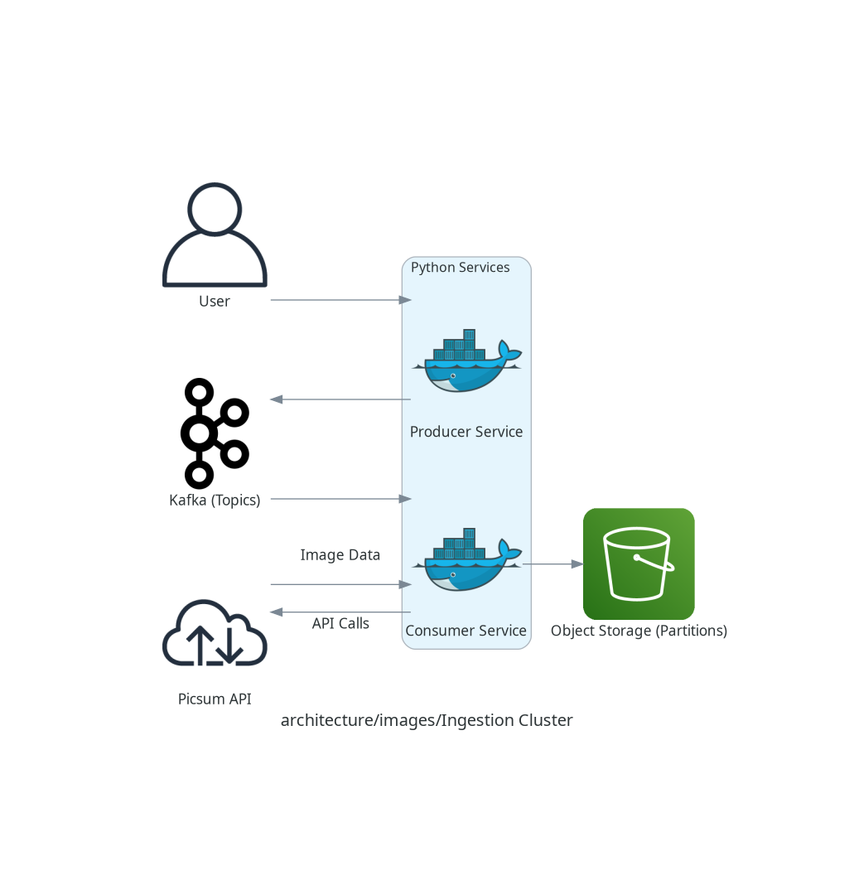
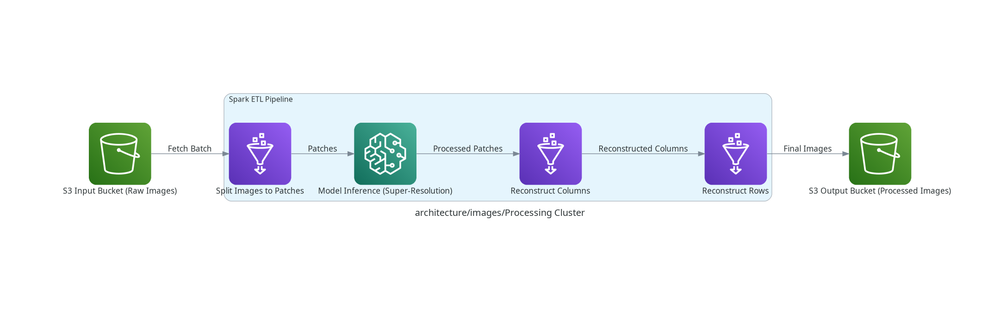

# Image Super-Resolution Pipeline with Apache Spark

This repository showcases an **end-to-end pipeline** for performing **image super-resolution** at scale using [FSRCNN](https://github.com/Lornatang/FSRCNN-PyTorch) and Apache Spark. The architecture is split into three main clusters—**Ingestion**, **Processing**, and **Notifications**—to handle data ingestion, distributed image processing, and final notifications or downstream consumption.

---

## Table of Contents

- [Architecture Overview](#architecture-overview)
- [Ingestion Cluster](#ingestion-cluster)
- [Processing Cluster](#processing-cluster)
- [Notifications Cluster](#notifications-cluster)
- [FSRCNN Model](#fsrcnn-model)
- [Pipeline Steps](#pipeline-steps)
- [Prerequisites](#prerequisites)
- [Running the Pipeline](#running-the-pipeline)
- [Automated Entry Point](#automated-entry-point)
- [Contributing](#contributing)
- [License](#license)

---

## Architecture Overview

Below is a high-level view of the complete architecture, illustrating how images progress from ingestion through processing to final consumption.



1. **Ingestion Cluster**  
   - Fetches image data (e.g., from an external API or user uploads).  
   - Publishes image references or metadata to Kafka.  
   - Stores images in an object storage system (e.g., S3) partitioned by ingestion date or image ID.

2. **Processing Cluster**  
   - Uses Apache Spark for distributed processing.  
   - Splits images into patches, applies super-resolution, and reconstructs final images.  
   - Writes processed images back to object storage.

3. **Notifications Cluster**  
   - Publishes an event (e.g., via Kafka or a REST callback) once images are processed.  
   - Notifies downstream consumers or microservices that the new, high-resolution images are available.

---

## Ingestion Cluster



- **Producer Service**: Retrieves images from an external API (e.g., [Picsum](https://picsum.photos/) or any custom data source).  
- **Kafka Topics**: Act as a buffer and reliable transport mechanism for high volumes of image references.  
- **Consumer Service**: Reads messages from Kafka, downloads the images, and stores them in an object storage bucket (such as S3) for later processing.

This decouples the image acquisition rate from the downstream processing speed.

---

## Processing Cluster



The processing cluster orchestrates the Spark ETL pipeline for super-resolution:

1. **Fetch Batch**: Reads raw images from the S3 input bucket (or local storage, for a proof-of-concept).
2. **Patch Extraction** (`mass_split.py`):  
   - Reads each image, converts it to grayscale (if desired), and normalizes pixel values to `[0, 1]`.  
   - Splits the image into patches of size `patch_size` × `patch_size`.  
   - Writes the patches as a Parquet dataset.
3. **Model Inference** (`batch_inference.py`):  
   - Reads the patches dataset.  
   - Broadcasts the FSRCNN model to all Spark executors.  
   - Runs super-resolution on each patch, converting the values back to `[0, 255]`.  
   - Writes the super-resolved patches to another Parquet dataset.
4. **Reconstruction** (`mass_reconstruct.py`):  
   - Groups super-resolved patches by `image_id` and stitches them together.  
   - Saves the reconstructed high-resolution images (e.g., PNG) to the output bucket.
5. **Write Final Output**: The final images are stored in the S3 output bucket (or local directory).

---

## Notifications Cluster

Once the high-resolution images are produced, the Notifications Cluster publishes a message (e.g., to Kafka or via a REST API) to signal that the images are ready. This event can trigger further pipelines, downstream analytics, or updates to front-end services.

---

## FSRCNN Model

We use **[FSRCNN (Fast Super-Resolution Convolutional Neural Network)](https://github.com/Lornatang/FSRCNN-PyTorch)**, a lightweight and efficient model for image super-resolution. Key benefits include:

- **Speed**: Faster inference compared to many other super-resolution architectures.
- **Quality**: Significant improvements in visual clarity and detail.
- **Simplicity**: Easy integration with PyTorch and PySpark for distributed inference.

---

## Pipeline Steps

1. **Ingestion**  
   - Pull images from an external API or user input.
   - Store them in S3 (or a local folder) for Spark consumption.
2. **Patch Extraction** (`mass_split.py`)  
   - Convert images to grayscale and normalize to `[0, 1]`.
   - Split images into patches.
   - Save patches as a Parquet dataset.
3. **Model Inference** (`batch_inference.py`)  
   - Read the Parquet dataset.
   - Apply FSRCNN super-resolution to each patch.
   - Rescale patch values to `[0, 255]` after inference.
   - Save the super-resolved patches as a Parquet dataset.
4. **Reconstruction** (`mass_reconstruct.py`)  
   - Group patches by `image_id` and reconstruct high-resolution images.
   - Save final images (PNG format) to the output bucket.
5. **Notification**  
   - Trigger a notification or event to indicate the images are ready.

---

## Prerequisites

- **Python**: Version 3.9–3.11 (avoid newer versions for compatibility).
- **Apache Spark**: Tested on Spark 3.x.
- **PyTorch**: Required for FSRCNN.
- **PySpark**: For running Spark jobs in Python.
- **Pillow (PIL)**: For image manipulation.

Ensure that all required Python libraries are listed in your [requirements.txt](requirements.txt).

---

## Running the Pipeline

1. **Create a Python Virtual Environment** (recommended):

   ```bash
   python -m venv venv
   source venv/bin/activate
   pip install -r requirements.txt

2. **Configure the Paths in config.yaml**:
dataset.low_resolution_dir: Directory (or S3 path) with raw images.
dataset.patches_dir: Output location for extracted patches.
dataset.inference_result_dir: Output location for super-resolved patches.
dataset.reconstructed_images_dir: Final directory for high-resolution images.
processing.model_path: Path to your FSRCNN model checkpoint.
processing.patch_size: Patch size used for splitting and reconstruction.
processing.upscale_factor: The super-resolution scale factor (e.g., 2 or 4).

3. **Automated Entry Point**
To run the three Spark jobs sequentially and enforce dependencies (i.e., each step runs only if the previous one succeeds), you can use an entry point script like this: python src/processing/entrypoint.py

## Contributing
Contributions and feedback are welcome! If you have suggestions for improvements, new features, or bug fixes, please open a pull request or create an issue.

### License
This project is provided under an open-source license. See LICENSE for details.

### Happy Super-Resolving!
Enjoy scaling your images with FSRCNN Apache Kafka and Spark in a fully distributed environment.